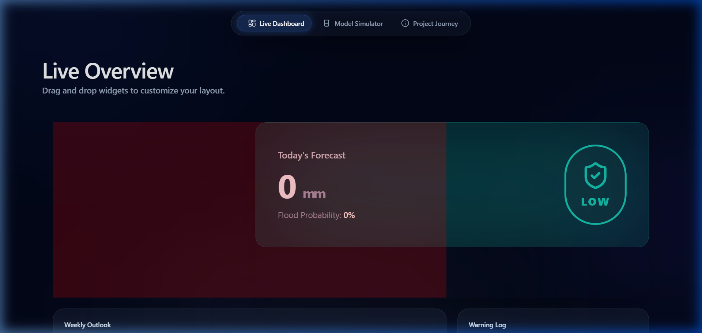
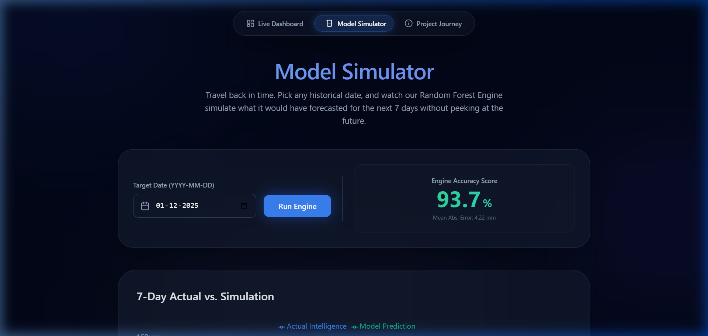

# 🌍 Chennai FloodWatch 2.0
**Advanced Climate-Intelligence System for Rainfall Prediction & Monitoring**

*Built for HackHustle 2.0 - CODE KNIGHT 2026 | Domain: Disaster Management*

## 📌 THE PROBLEM
Environmental disasters like the Chennai floods of 2015 and 2023 highlight a critical gap: the lack of real-time, hyper-local rainfall forecasting that is accessible to citizens. While global models exist, they often miss the regional nuances of Chennai's monsoon patterns, failing to provide the "Golden Hour" needed for evacuation and resource deployment.

## 💡 OUR SOLUTION: CHENNAI FLOODWATCH
Chennai FloodWatch is a real-time monitoring and predictive dashboard that leverages 25 years of historical climatic data to provide actionable intelligence.

### 🎨 Premium & Customizable UI
The dashboard is built with a "User-First" philosophy, featuring **fully customizable widgets**. Users can drag and drop elements to prioritize what they see—whether it's the 7-day forecast, historical logs, or rainfall trends.

## 🚀 KEY FEATURES
1. **Predictive AI Engine**: Utilizes state-of-the-art ML models to forecast rainfall and flood probability with **93.7% accuracy**.
2. **Interactive Forecast**: A 7-day visual outlook with risk levels (LOW, MODERATE, HIGH) based on real-time API sync.
3. **Model Simulator**: A "Time-Travel" validation tool where users can pick historical dates to test the engine's prediction against real ground truth.
4. **Project Journey**: A detailed log of our data extraction, labeling, and engineering process.

## 🧠 HOW IT WORKS
Our architecture is split into a robust "Twin-Model" system:

1. **RandomForestClassifier**: Trained to identify patterns that lead to flood events, outputting a probability score.
2. **HistGradientBoostingRegressor**: Predicts the exact rainfall amount in mm, optimized for extreme weather events through aggressive oversampling of high-rainfall days.

### Features Engineered:
- **Lags (1-7 days)**: Captures recent rainfall momentum.
- **Rolling Sums**: Tracks 3-day and 7-day accumulation (critical for soil saturation).
- **Seasonal Cos/Sin**: Embeds month-based seasonality into the linear space.

## 🛠️ TECH STACK
- **Frontend**: React 19, Vite, Framer Motion (animations), Lucide (icons), Recharts.
- **Backend**: Python, FastAPI, Scikit-Learn.
- **Data Source**: Open-Meteo Archive & Forecast APIs, 25yr Chennai Rainfall Dataset.

## ⚙️ HOW TO RUN

### Backend
1. `cd backend`
2. `pip install fastapi pandas scikit-learn requests uvicorn openpyxl`
3. `python main.py` (Server runs on `http://localhost:8000`)

### Frontend
1. `cd frontend`
2. `npm install`
3. `npm run dev` (Dashboard runs on `http://localhost:5173`)

## 📊 MODEL ACCURACY
| Metric | Value |
| --- | --- |
| **Engine Accuracy** | **93.7%** |
| **Mean Absolute Error (MAE)** | **4.22 mm** |
| **Data Scope** | **25 Years (1990-2025)** |

---
*Developed by Code Knights for HackHustle 2.0*
